# 2016-sans-holiday-hack-challenge

<!-- TOC depthFrom:1 depthTo:6 withLinks:1 updateOnSave:1 orderedList:0 -->

- [2016-sans-holiday-hack-challenge](#2016-sans-holiday-hack-challenge)
	- [About](#about)
	- [Step by step guide](#step-by-step-guide)
	- [Part 1: A Most Curious Business Card](#part-1-a-most-curious-business-card)
		- [1) What is the secret message in Santa's tweets?](#1-what-is-the-secret-message-in-santas-tweets)
		- [2) What is inside the ZIP file distributed by Santa's team?](#2-what-is-inside-the-zip-file-distributed-by-santas-team)
	- [Part 2: Awesome Package Konveyance](#part-2-awesome-package-konveyance)
		- [3) What username and password are embedded in the APK file?](#3-what-username-and-password-are-embedded-in-the-apk-file)
		- [4) What is the name of the audible component (audio file) in the SantaGram APK file?](#4-what-is-the-name-of-the-audible-component-audio-file-in-the-santagram-apk-file)
	- [Part 3: A Fresh-Baked Holiday Pi](#part-3-a-fresh-baked-holiday-pi)
		- [5) What is the password for the "cranpi" account on the Cranberry Pi system?](#5-what-is-the-password-for-the-cranpi-account-on-the-cranberry-pi-system)
		- [6) How did you open each terminal door and where had the villain imprisoned Santa?](#6-how-did-you-open-each-terminal-door-and-where-had-the-villain-imprisoned-santa)
	- [Part 4: My Gosh... It's Full of Holes](#part-4-my-gosh-its-full-of-holes)
		- [7) ONCE YOU GET APPROVAL ...](#7-once-you-get-approval-)
		- [8) What are the names of the audio files you discovered from each system above?](#8-what-are-the-names-of-the-audio-files-you-discovered-from-each-system-above)

<!-- /TOC -->

## About

This is a write-up for the [2016 SANS Holiday Hack Challenge](https://holidayhackchallenge.com/2016/index.html). What follows is a step by step guide. A summary of answers to the questions is given at the end of the document.

## Step by step guide

You start in a room. Talk to Jessica and Josh to get some info and the first
two quests. Browse the room for Santa's business card (it is lying in front of the
fireplace).

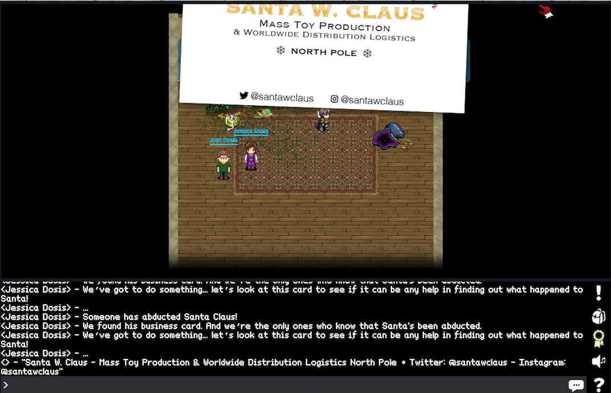

This gives us two pieces of information to have a look at:
* Santa's Twitter account `@santawclaus`
* Santa's Instagram account `@santawclaus` 

We will check out the Twitter account first.


Santa's tweets look a bit odd. Since the first question directly asks for a secret message in them, we decided to pull them all down via the Twitter API.

Turns out that there is a Python package for talking to Twitter called [tweepy](https://github.com/tweepy/tweepy). They do offer a solid [documentation](http://tweepy.readthedocs.io/en/v3.5.0/). The most challenging part was to actually create the necessary Twitter API credentials [here](https://apps.twitter.com/). With that out of the way, a small python script like the following will pull all 350 tweets from `@santawclaus`.

```python
import tweepy

consumer_key='<YOUR CONSUMER KEY>'
consumer_secret='<YOUR CONSUMER SECRET>'
access_token='<YOUR ACCESS TOKEN>'
access_token_secret='<YOUR ACCESS TOKEN SECRET>'

auth = tweepy.OAuthHandler(consumer_key, consumer_secret)
auth.set_access_token(access_token, access_token_secret)

all_tweets = api.user_timeline('santawclaus', count=200)

max_id = all_tweets[-1].id - 1

all_tweets.extend(api.user_timeline('santawclaus', count=200, max_id=max_id))

for tweet in all_tweets:
    print tweet.text
```

The code is a bit messy. Since the maximum count that you can specify is 200, and Santa has done 350 tweets, we have to call the API twice. The `max_id` parameter ensures that we get only older tweets in the second call compared to the first one. At first, I overlooked this issue - getting an incomplete secret message.

The correct result looks as follows on the terminal:

```
SANTAELFHOHOHOCHRISTMASSANTACHRISTMASPEACEONEARTHCHRISTMASELFSANTAELFHOHOHO
GOODWILLTOWARDSMENSANTAPEACEONEARTHHOHOHOJOYSANTAGOODWILLTOWARDSMENJOYJOYQQ
GOODWILLTOWARDSMENGOODWILLTOWARDSMENJOYHOHOHOJOYELFELFPEACEONEARTHJOYHOHOHO
GOODWILLTOWARDSMENSANTACHRISTMASCHRISTMASPEACEONEARTHNORTHPOLEHOHOHOELFELFQ
JOYNORTHPOLECHRISTMASPEACEONEARTHNORTHPOLEJOYGOODWILLTOWARDSMENELFCHRISTMAS
CHRISTMASGOODWILLTOWARDSMENELFHOHOHOCHRISTMASPEACEONEARTHPEACEONEARTHJOYELF
HOHOHOGOODWILLTOWARDSMENNORTHPOLEGOODWILLTOWARDSMENSANTAPEACEONEARTHELFELFQ
GOODWILLTOWARDSMENP???????????????????????????????4CHRISTMASJOYELFELFSANTAQ
NORTHPOLEHOHOHOELFf...............................]PEACEONEARTHHOHOHOSANTAQ
SANTASANTAJOYELFQQf...............................]PEACEONEARTHCHRISTMASELF
CHRISTMASELFELFJOYf...............................]HOHOHOSANTAHOHOHOELFJOYQ
SANTASANTAJOYJOYQQf...............................]GOODWILLTOWARDSMENHOHOHO
NORTHPOLEELFELFELFf...............................]PEACEONEARTHHOHOHOSANTAQ
NORTHPOLECHRISTMASf...............................]PEACEONEARTHCHRISTMASJOY
PEACEONEARTHSANTAQf...............................]PEACEONEARTHNORTHPOLEELF
JOYCHRISTMASSANTAQf...............................]CHRISTMASHOHOHOCHRISTMAS
NORTHPOLEHOHOHOJOYf...............................]PEACEONEARTHPEACEONEARTH
SANTAELFELFJOYJOYQf.......aaaaaa/....._aaaaa......]PEACEONEARTHNORTHPOLEELF
GOODWILLTOWARDSMENf.......QQWQWQf.....]ELFWQ......]HOHOHOHOHOHOCHRISTMASJOY
NORTHPOLESANTAJOYQf.......HOHOHOf.....]JOYQQ......]CHRISTMASCHRISTMASHOHOHO
NORTHPOLEELFJOYJOYf.......SANTAQf.....]JOYQQ......]NORTHPOLEPEACEONEARTHELF
SANTAPEACEONEARTHQf.......HOHOHOf.....]SANTA......]PEACEONEARTHCHRISTMASELF
ELFSANTASANTAJOYQQf.......HOHOHOf.....]JOYQW......]CHRISTMASPEACEONEARTHJOY
JOYHOHOHONORTHPOLEf.......SANTAQ[.....)ELFQE......]PEACEONEARTHPEACEONEARTH
HOHOHOCHRISTMASJOYf.......$WJOYQ(......$WQQ(......]GOODWILLTOWARDSMENSANTAQ
JOYPEACEONEARTHELFf.......)JOYQ@........??'.......]SANTAPEACEONEARTHHOHOHOQ
JOYJOYPEACEONEARTHL........?$QV'..................]CHRISTMASJOYNORTHPOLEJOY
SANTAJOYCHRISTMASQk...............................jGOODWILLTOWARDSMENJOYJOY
GOODWILLTOWARDSMENW...............................jJOYNORTHPOLEJOYELFSANTAQ
HOHOHOSANTAJOYELFQQ...............................GOODWILLTOWARDSMENHOHOHOQ
CHRISTMASSANTASANTA;................;............=JOYNORTHPOLEPEACEONEARTHQ
GOODWILLTOWARDSMENQL...............)L............jHOHOHOHOHOHOCHRISTMASELFQ
CHRISTMASHOHOHOELFQQ...............dQ,..........&lt;GOODWILLTOWARDSMENHOHOHOQQ
GOODWILLTOWARDSMENQQL.............&lt;QQm,........_HOHOHOHOHOHOCHRISTMASELFELF
SANTACHRISTMASELFELFQc..........._mJOYQc......aPEACEONEARTHCHRISTMASSANTAQQ
CHRISTMASPEACEONEARTHQw........._mSANTAWmwaawGOODWILLTOWARDSMENSANTAJOYELFQ
PEACEONEARTHELFSANTAELFQw,,..__yHOHOHOELFQWQQWGOODWILLTOWARDSMENHOHOHOSANTA
ELFHOHOHONORTHPOLEELFJOYWGOODWILLTOWARDSMENCHRISTMASSANTACHRISTMASJOYSANTAQ
ELFELFHOHOHOHOHOHOHOHOHONORTHPOLEJOYHOHOHOGOODWILLTOWARDSMENELFELFELFSANTAQ
ELFHOHOHOJOYPEACEONEARTHPEACEONEARTHJOYGOODWILLTOWARDSMENJOYELFPEACEONEARTH
GOODWILLTOWARDSMENJOYGOODWILLTOWARDSMENGOODWILLTOWARDSMENSANTAELFJOYJOYJOYQ
ELFSANTAPEACEONEARTHJOYJOYQQDT????????????????????4NORTHPOLEPEACEONEARTHELF
NORTHPOLENORTHPOLESANTAQWT^.......................]NORTHPOLEELFHOHOHOJOYELF
HOHOHOHOHOHOCHRISTMASQQP`.........................]JOYGOODWILLTOWARDSMENELF
ELFPEACEONEARTHSANTAQQ(...........................]HOHOHOSANTACHRISTMASJOYQ
JOYJOYCHRISTMASELFJOY(............................]GOODWILLTOWARDSMENHOHOHO
CHRISTMASELFELFELFQQf.............................]HOHOHONORTHPOLEJOYELFJOY
SANTACHRISTMASJOYQQD..............................]HOHOHOHOHOHOSANTASANTAQQ
HOHOHOELFSANTAELFQQ(..............................]GOODWILLTOWARDSMENHOHOHO
GOODWILLTOWARDSMENW...............................]NORTHPOLEHOHOHOHOHOHOJOY
CHRISTMASHOHOHOJOYF...............................]GOODWILLTOWARDSMENSANTAQ
CHRISTMASCHRISTMAS[.........._aaaaaaaaaaaaaaaaaaaajPEACEONEARTHELFNORTHPOLE
SANTANORTHPOLEELFQ(........jJOYQWQWWQWWQWWWWWWWWWGOODWILLTOWARDSMENHOHOHOQQ
ELFPEACEONEARTHELF;.......jWWSANTAGOODWILLTOWARDSMENSANTAGOODWILLTOWARDSMEN
ELFJOYNORTHPOLEJOY`.......QWGOODWILLTOWARDSMENGOODWILLTOWARDSMENCHRISTMASQQ
PEACEONEARTHJOYELF.......]WPEACEONEARTHCHRISTMASNORTHPOLEPEACEONEARTHHOHOHO
CHRISTMASJOYHOHOHO.......]HOHOHOELFGOODWILLTOWARDSMENPEACEONEARTHCHRISTMASQ
JOYCHRISTMASJOYELF.......]PEACEONEARTHCHRISTMASGOODWILLTOWARDSMENELFHOHOHOQ
JOYPEACEONEARTHJOY.......)WGOODWILLTOWARDSMENSANTANORTHPOLEJOYPEACEONEARTHQ
CHRISTMASHOHOHOELF........$WPEACEONEARTHNORTHPOLESANTAPEACEONEARTHSANTAJOYQ
JOYHOHOHOELFELFJOY;.......-QWCHRISTMASGOODWILLTOWARDSMENPEACEONEARTHJOYELFQ
HOHOHOCHRISTMASJOY(........-?$QWJOYCHRISTMASSANTACHRISTMASCHRISTMASHOHOHOQQ
ELFJOYELFCHRISTMASf...............................]PEACEONEARTHNORTHPOLEJOY
ELFHOHOHOSANTAELFQh...............................]GOODWILLTOWARDSMENHOHOHO
SANTACHRISTMASELFQQ,..............................]PEACEONEARTHPEACEONEARTH
GOODWILLTOWARDSMENQL..............................]HOHOHOELFCHRISTMASSANTAQ
GOODWILLTOWARDSMENQQ,.............................]PEACEONEARTHELFHOHOHOJOY
NORTHPOLESANTAHOHOHOm.............................]HOHOHOGOODWILLTOWARDSMEN
PEACEONEARTHCHRISTMASg............................]ELFHOHOHOSANTANORTHPOLEQ
NORTHPOLECHRISTMASJOYQm,..........................]NORTHPOLECHRISTMASSANTAQ
SANTASANTACHRISTMASSANTAw,........................]GOODWILLTOWARDSMENSANTAQ
GOODWILLTOWARDSMENHOHOHOWQga,,....................]PEACEONEARTHPEACEONEARTH
PEACEONEARTHJOYCHRISTMASELFWCHRISTMASGOODWILLTOWARDSMENJOYPEACEONEARTHSANTA
PEACEONEARTHPEACEONEARTHCHRISTMASJOYSANTAPEACEONEARTHCHRISTMASELFHOHOHOELFQ
GOODWILLTOWARDSMENNORTHPOLECHRISTMASPEACEONEARTHHOHOHOELFJOYNORTHPOLEELFELF
JOYGOODWILLTOWARDSMENSANTACHRISTMASJOYPEACEONEARTHHOHOHOELFCHRISTMASHOHOHOQ
HOHOHOCHRISTMASHOHOHOSANTANORTHPOLEPEACEONEARTHJOYPEACEONEARTHJOYJOYHOHOHOQ
JOYELFGOODWILLTOWARDSMENSANTAQBTT???TT$SANTASANTAPEACEONEARTHNORTHPOLEJOYQQ
SANTACHRISTMASCHRISTMASJOYWP"`.........-"9NORTHPOLEPEACEONEARTHCHRISTMASELF
SANTAELFELFELFSANTAJOYQQWP`...............-4JOYSANTANORTHPOLEJOYSANTASANTAQ
ELFELFELFHOHOHOHOHOHOQQ@'..................."$CHRISTMASELFSANTANORTHPOLEELF
ELFCHRISTMASSANTAELFQQP`.....................-$WELFWPEACEONEARTHSANTASANTAQ
SANTANORTHPOLEJOYELFQE........................-$SANTAELFWGOODWILLTOWARDSMEN
NORTHPOLEELFELFELFQQ@`.........................-QWPEACEONEARTHPEACEONEARTHQ
PEACEONEARTHJOYJOYQQ(...........................]CHRISTMASHOHOHOELFSANTAJOY
HOHOHOCHRISTMASELFQP.............................$NORTHPOLEJOYQWJOYWJOYWELF
SANTACHRISTMASJOYQQ(.............................]WSANTAWPEACEONEARTHJOYELF
HOHOHOSANTAJOYELFQW............_aaaas,............QWCHRISTMASQWHOHOHOSANTAQ
SANTAPEACEONEARTHQf........._wELFWWWWQQw,.........3ELFHOHOHOJOYJOYSANTAELFQ
CHRISTMASSANTAELFQ[........&lt;HOHOHOELFELFQc........]CHRISTMASPEACEONEARTHELF
CHRISTMASCHRISTMAS(......._PEACEONEARTHJOY/.......)NORTHPOLESANTAELFQWELFWQ
PEACEONEARTHSANTAQ`.......dNORTHPOLEHOHOHOm.......:NORTHPOLEWCHRISTMASJOYQQ
PEACEONEARTHELFELF........SANTANORTHPOLEJOY;.......SANTASANTAJOYQWSANTAJOYQ
PEACEONEARTHSANTAQ.......]ELFSANTAJOYJOYELF[.......GOODWILLTOWARDSMENSANTAQ
GOODWILLTOWARDSMEN.......]ELFNORTHPOLEJOYQQf.......ELFSANTAJOYHOHOHOQQWELFQ
GOODWILLTOWARDSMEN.......]ELF.......]JOYELF[.......PEACEONEARTHPEACEONEARTH
HOHOHOJOYNORTHPOLE.......]JOY.......]SANTAQ'.......SANTASANTAQQWNORTHPOLEQQ
CHRISTMASNORTHPOLE:......)WQQ.......]SANTAD........NORTHPOLESANTAELFWELFJOY
ELFCHRISTMASSANTAQ;......-JOY.......]ELFQW'.......:PEACEONEARTHCHRISTMASJOY
CHRISTMASSANTAELFQ[.......WQQ.......]ELFD'........=HOHOHOGOODWILLTOWARDSMEN
ELFELFSANTAJOYELFQL.......]QQ.......]ELF..........]PEACEONEARTHQWCHRISTMASQ
NORTHPOLESANTAELFQm.......+QQ.......]ELF;.........jWNORTHPOLENORTHPOLEELFWQ
JOYELFHOHOHOSANTAQQ.................]JOY[.........mCHRISTMASCHRISTMASQQWELF
NORTHPOLENORTHPOLEQ[................]JOYL........_PEACEONEARTHSANTASANTAELF
SANTANORTHPOLEJOYQQm................]ELFk........dHOHOHOPEACEONEARTHQQWJOYQ
PEACEONEARTHHOHOHOQQc...............]JOYm.......]PEACEONEARTHHOHOHOWHOHOHOQ
CHRISTMASHOHOHOJOYQQm...............]ELFQ......_GOODWILLTOWARDSMENNORTHPOLE
JOYELFNORTHPOLEJOYELFL..............]JOYQ;....&lt;SANTAHOHOHONORTHPOLEELFSANTA
PEACEONEARTHELFHOHOHOQ,.............]JOYQ[...wPEACEONEARTHELFSANTAWHOHOHOQQ
CHRISTMASELFELFELFJOYQ6.............]ELFQL_wPEACEONEARTHHOHOHOCHRISTMASELFQ
HOHOHOJOYNORTHPOLEQWELFwaaaaaaaaaaaajPEACEONEARTHGOODWILLTOWARDSMENSANTAQWQ
CHRISTMASELFPEACEONEARTHWWWQWWQWWWWELFELFSANTANORTHPOLESANTAELFQQWJOYHOHOHO
CHRISTMASNORTHPOLEHOHOHOHOHOHOCHRISTMASGOODWILLTOWARDSMENNORTHPOLEHOHOHOWQQ
GOODWILLTOWARDSMENNORTHPOLENORTHPOLESANTANORTHPOLEJOYSANTAELFELFWCHRISTMASQ
GOODWILLTOWARDSMENHOHOHOHOHOHONORTHPOLEELFSANTAELFNORTHPOLEPEACEONEARTHELFQ
PEACEONEARTHELFELFQWPEACEONEARTHPEACEONEARTHHOHOHOPEACEONEARTHWNORTHPOLEWQQ
ELFPEACEONEARTHCHRISTMASELFPEACEONEARTHJOYNORTHPOLEGOODWILLTOWARDSMENSANTAQ
SANTASANTASANTAJOYELFJOYWGOODWILLTOWARDSMENPEACEONEARTHSANTAWPEACEONEARTHQQ
PEACEONEARTHSANTAJOYGOODWILLTOWARDSMENSANTACHRISTMASELFCHRISTMASELFJOYQWELF
CHRISTMASCHRISTMASELFELFHOHOHOWJOYWNORTHPOLESANTACHRISTMASWSANTAJOYQQWJOYQQ
ELFJOYSANTAJOYJOYQQWJOYWPEACEONEARTHNORTHPOLEHOHOHOHOHOHONORTHPOLEELFJOYELF
ELFNORTHPOLEJOYSANTANORTHPOLECHRISTMASQQWPEACEONEARTHJOYQWHOHOHOJOYWJOYELFQ
NORTHPOLECHRISTMASHOHOHOSANTAWPEACEONEARTHGOODWILLTOWARDSMENCHRISTMASHOHOHO
GOODWILLTOWARDSMENSANTACHRISTMASSANTAQQWELFHOHOHOSANTAQQWJOYSANTAQWSANTAJOY
JOYNORTHPOLEJOYPEACEONEARTHWELFELFQQWNORTHPOLEQWHOHOHONORTHPOLEELFELFHOHOHO
CHRISTMASSANTASANTAWJOYWCHRISTMASHOHOHONORTHPOLEJOYQQWHOHOHOSANTAWNORTHPOLE
PEACEONEARTHSANTASANTAPEACEONEARTHNORTHPOLEJOYJOYJOYELFCHRISTMASHOHOHOSANTA
SANTASANTACHRISTMASJOYJOYJOYELFJOYQWHOHOHOJOYQWPEACEONEARTHELFQQWCHRISTMASQ
GOODWILLTOWARDSMENELFPEACEONEARTHHOHOHOCHRISTMASELFQWHOHOHOWCHRISTMASHOHOHO
CHRISTMASELFELFPEACEONEARTHWELFQQWHOHOHOQQWCHRISTMASELFJOYNORTHPOLEHOHOHOQQ
SANTAPEACEONEARTHQQWJOYWCHRISTMASHOHOHOPEACEONEARTHGOODWILLTOWARDSMENJOYQWQ
JOYJOYHOHOHOELFELFP???????????????????????????????4SANTAQQWPEACEONEARTHELFQ
NORTHPOLENORTHPOLEf...............................]PEACEONEARTHQQWHOHOHOWQQ
CHRISTMASJOYHOHOHOf...............................]ELFGOODWILLTOWARDSMENELF
NORTHPOLEELFELFELFf...............................]PEACEONEARTHHOHOHOQQWELF
NORTHPOLEHOHOHOELFf...............................]CHRISTMASJOYQWSANTASANTA
SANTAJOYNORTHPOLEQf...............................]SANTAHOHOHOWJOYCHRISTMAS
GOODWILLTOWARDSMENf...............................]PEACEONEARTHHOHOHOQWJOYQ
ELFPEACEONEARTHELFf...............................]GOODWILLTOWARDSMENHOHOHO
JOYCHRISTMASELFELFf...............................]GOODWILLTOWARDSMENSANTAQ
GOODWILLTOWARDSMENf...............................]NORTHPOLEPEACEONEARTHJOY
ELFSANTAHOHOHOELFQf.......aaaaaa/....._aaaaa......]GOODWILLTOWARDSMENWELFQQ
NORTHPOLEHOHOHOELFf.......QWWWWQf.....]QQWWQ......]HOHOHOHOHOHOQQWJOYSANTAQ
SANTANORTHPOLEJOYQf.......HOHOHOf.....]JOYQQ......]HOHOHOHOHOHONORTHPOLEELF
NORTHPOLEJOYJOYELFf.......JOYELFf.....]SANTA......]NORTHPOLEHOHOHONORTHPOLE
SANTASANTASANTAELFf.......JOYELFf.....]SANTA......]NORTHPOLENORTHPOLEELFELF
GOODWILLTOWARDSMENf.......JOYJOYf.....]JOYQW......]PEACEONEARTHHOHOHOQWELFQ
GOODWILLTOWARDSMENf.......HOHOHO[.....)JOYQE......]HOHOHOELFHOHOHOQQWJOYJOY
JOYNORTHPOLEELFELFf.......$WELFQ(......$WQQ(......]PEACEONEARTHNORTHPOLEELF
NORTHPOLEJOYELFJOYf.......)ELFQ@........??'.......]CHRISTMASPEACEONEARTHJOY
SANTAPEACEONEARTHQL........?$QV'..................]HOHOHOGOODWILLTOWARDSMEN
JOYELFPEACEONEARTHk...............................jJOYSANTACHRISTMASWJOYJOY
SANTAPEACEONEARTHQW...............................jSANTAGOODWILLTOWARDSMENQ
CHRISTMASSANTAELFQQ...............................HOHOHOPEACEONEARTHSANTAQQ
ELFCHRISTMASELFELFQ;................;............=NORTHPOLENORTHPOLEJOYELFQ
NORTHPOLEJOYSANTAQQ[...............)L............jPEACEONEARTHJOYHOHOHOQQWQ
CHRISTMASHOHOHOJOYQm...............dQ,..........&lt;GOODWILLTOWARDSMENQWSANTAQ
SANTACHRISTMASSANTAQL.............&lt;QQm,........_JOYELFGOODWILLTOWARDSMENELF
HOHOHOSANTASANTAJOYQQc..........._mELFQc......aGOODWILLTOWARDSMENSANTAJOYWQ
CHRISTMASHOHOHOJOYJOYQw........._mELFQQWmwaawGOODWILLTOWARDSMENNORTHPOLEELF
NORTHPOLEELFPEACEONEARTHw,,..__yELFJOYJOYQWQWQWGOODWILLTOWARDSMENCHRISTMASQ
JOYNORTHPOLEELFNORTHPOLEWGOODWILLTOWARDSMENNORTHPOLEJOYJOYJOYSANTAQQWELFWQQ
JOYSANTAELFHOHOHOQQWNORTHPOLENORTHPOLEGOODWILLTOWARDSMENSANTASANTAHOHOHOJOY
ELFHOHOHOCHRISTMASCHRISTMASELFPEACEONEARTHHOHOHOELFCHRISTMASHOHOHOELFJOYELF
JOYPEACEONEARTHJOYNORTHPOLEGOODWILLTOWARDSMENHOHOHONORTHPOLEHOHOHOELFELFJOY
HOHOHOPEACEONEARTHELFJOYJOYQV?"~....--"?$CHRISTMASELFWPEACEONEARTHQWHOHOHOQ
CHRISTMASCHRISTMASJOYELFWW?`.............-?CHRISTMASHOHOHOQWELFWSANTAJOYWQQ
SANTAPEACEONEARTHQQWELFQP`.................-4HOHOHOWCHRISTMASNORTHPOLESANTA
CHRISTMASNORTHPOLEJOYQW(.....................)WGOODWILLTOWARDSMENNORTHPOLEQ
GOODWILLTOWARDSMENJOYW'.......................)WSANTAJOYQQWNORTHPOLEHOHOHOQ
JOYNORTHPOLEHOHOHOJOY(.........................)PEACEONEARTHSANTAELFWJOYWQQ
GOODWILLTOWARDSMENQQf...........................4PEACEONEARTHELFQWCHRISTMAS
NORTHPOLEHOHOHOELFQW`...........................-HOHOHOWCHRISTMASCHRISTMASQ
GOODWILLTOWARDSMENQf.............................]JOYJOYSANTAELFWCHRISTMASQ
HOHOHONORTHPOLEJOYQ`.............................-HOHOHOELFQWCHRISTMASSANTA
ELFELFELFJOYHOHOHOE.........._wwQWQQmga,..........$GOODWILLTOWARDSMENJOYWQQ
NORTHPOLECHRISTMASf........_yJOYWSANTAQQg,........]PEACEONEARTHPEACEONEARTH
SANTANORTHPOLEJOYQ[......._ELFELFSANTAELFQ,.......]CHRISTMASSANTASANTAWJOYQ
CHRISTMASCHRISTMAS;.......dPEACEONEARTHJOYk.......=JOYJOYHOHOHOQWJOYWHOHOHO
ELFNORTHPOLEELFELF......._HOHOHOCHRISTMASQQ,.......NORTHPOLEQWSANTASANTAELF
PEACEONEARTHJOYJOY.......]PEACEONEARTHJOYQQ[.......GOODWILLTOWARDSMENELFJOY
HOHOHOELFNORTHPOLE.......]PEACEONEARTHSANTAf.......NORTHPOLEHOHOHOHOHOHOELF
ELFSANTAELFHOHOHOQ.......]NORTHPOLEHOHOHOQQ[.......GOODWILLTOWARDSMENHOHOHO
CHRISTMASCHRISTMAS.......)PEACEONEARTHJOYQQ(.......HOHOHOHOHOHOSANTAWHOHOHO
SANTASANTAELFJOYQQ........HOHOHOCHRISTMASQ@.......:NORTHPOLEELFQWSANTASANTA
CHRISTMASCHRISTMAS;.......]PEACEONEARTHELF[.......&lt;HOHOHOSANTANORTHPOLEQQWQ
HOHOHOPEACEONEARTH[........4HOHOHOJOYELFQf........]PEACEONEARTHHOHOHOHOHOHO
CHRISTMASCHRISTMASL........."HWJOYSANTAD^.........jNORTHPOLENORTHPOLEHOHOHO
GOODWILLTOWARDSMENm............"!???!"`...........NORTHPOLEHOHOHOWJOYQWELFQ
CHRISTMASJOYELFELFQ/.............................]WNORTHPOLECHRISTMASHOHOHO
SANTAJOYCHRISTMASQQk.............................dPEACEONEARTHELFELFHOHOHOQ
SANTAPEACEONEARTHJOY/...........................&lt;NORTHPOLECHRISTMASHOHOHOQQ
ELFSANTASANTASANTAQQm...........................mJOYELFSANTAPEACEONEARTHELF
CHRISTMASCHRISTMASELFk.........................jGOODWILLTOWARDSMENQWJOYWELF
ELFJOYCHRISTMASJOYJOYQL.......................jNORTHPOLENORTHPOLEJOYJOYJOYQ
ELFELFJOYSANTAJOYELFELFg,..................._yGOODWILLTOWARDSMENQQWSANTAELF
PEACEONEARTHJOYELFQWSANTAc.................aQWCHRISTMASHOHOHOSANTAJOYHOHOHO
SANTAJOYJOYPEACEONEARTHELFQa,..........._wQWWHOHOHOSANTAJOYELFQQWJOYSANTAQQ
HOHOHOELFJOYPEACEONEARTHQQWJOYmwwaaaawyJOYWCHRISTMASHOHOHOPEACEONEARTHJOYWQ
ELFCHRISTMASSANTASANTASANTAJOYQQWWWWQWGOODWILLTOWARDSMENJOYELFQWCHRISTMASQQ
ELFCHRISTMASSANTASANTASANTAJOYQQWWWWQWGOODWILLTOWARDSMENJOYELFQWCHRISTMASQQ
SANTAHOHOHOELFPEACEONEARTHGOODWILLTOWARDSMENJOYPEACEONEARTHSANTASANTAJOYWQQ
HOHOHOJOYELFJOYELFQWGOODWILLTOWARDSMENPEACEONEARTHGOODWILLTOWARDSMENELFELFQ
NORTHPOLEJOYJOYELFHOHOHOWPEACEONEARTHNORTHPOLECHRISTMASHOHOHOQWELFJOYQQWJOY
GOODWILLTOWARDSMENSANTAJOYNORTHPOLENORTHPOLEHOHOHOHOHOHOGOODWILLTOWARDSMENQ
CHRISTMASJOYSANTANORTHPOLEV?"-....................]GOODWILLTOWARDSMENQWJOYQ
GOODWILLTOWARDSMENSANTAW?`........................]GOODWILLTOWARDSMENSANTAQ
HOHOHOELFJOYJOYELFQWQQD'..........................]HOHOHONORTHPOLEQWHOHOHOQ
PEACEONEARTHHOHOHOJOYP`...........................]SANTAJOYELFWHOHOHOHOHOHO
PEACEONEARTHHOHOHOQQD`............................]JOYPEACEONEARTHSANTAELFQ
PEACEONEARTHHOHOHOQW'.............................]CHRISTMASJOYELFQWHOHOHOQ
ELFPEACEONEARTHELFQf..............................]PEACEONEARTHELFNORTHPOLE
SANTACHRISTMASJOYQQ`..............................]NORTHPOLEQQWNORTHPOLEQWQ
CHRISTMASHOHOHOELFE...............................]SANTAGOODWILLTOWARDSMENQ
GOODWILLTOWARDSMENf...............................]GOODWILLTOWARDSMENSANTAQ
ELFCHRISTMASELFJOY[.........amWNORTHPOLEGOODWILLTOWARDSMENJOYJOYJOYQWELFWQQ
PEACEONEARTHJOYJOY(......._QQWHOHOHOWJOYWPEACEONEARTHPEACEONEARTHNORTHPOLEQ
NORTHPOLEELFELFJOY`.......mSANTAQQWCHRISTMASQQWGOODWILLTOWARDSMENQQWHOHOHOQ
JOYSANTANORTHPOLEQ`......=CHRISTMASPEACEONEARTHSANTANORTHPOLENORTHPOLESANTA
NORTHPOLESANTAJOYQ.......]NORTHPOLEPEACEONEARTHELFHOHOHOGOODWILLTOWARDSMENQ
ELFNORTHPOLESANTAQ.......]GOODWILLTOWARDSMENQWELFJOYPEACEONEARTHCHRISTMASQQ
HOHOHONORTHPOLEJOY.......]GOODWILLTOWARDSMENJOYJOYQWPEACEONEARTHJOYWSANTAWQ
PEACEONEARTHJOYELF.......-QWSANTAELFWSANTAWHOHOHOPEACEONEARTHCHRISTMASELFQQ
CHRISTMASSANTAJOYQ........]SANTASANTASANTAGOODWILLTOWARDSMENPEACEONEARTHELF
ELFHOHOHOCHRISTMAS;........?ELFJOYPEACEONEARTHELFQWGOODWILLTOWARDSMENHOHOHO
GOODWILLTOWARDSMEN[.........-"????????????????????4ELFCHRISTMASHOHOHOQQWELF
SANTASANTAJOYSANTAL...............................]HOHOHOQWJOYELFQQWJOYJOYQ
NORTHPOLECHRISTMASQ...............................]NORTHPOLEELFQWJOYJOYELFQ
SANTANORTHPOLEELFQWc..............................]GOODWILLTOWARDSMENSANTAQ
JOYSANTACHRISTMASQQm..............................]ELFNORTHPOLECHRISTMASELF
CHRISTMASSANTASANTAQL.............................]PEACEONEARTHWJOYJOYQQWQQ
ELFNORTHPOLEHOHOHOJOYc............................]SANTACHRISTMASJOYELFJOYQ
SANTAELFHOHOHOJOYJOYQQc...........................]PEACEONEARTHSANTAQQWJOYQ
GOODWILLTOWARDSMENSANTAw,.........................]NORTHPOLEHOHOHONORTHPOLE
NORTHPOLENORTHPOLEQWSANTAa,.......................]PEACEONEARTHWSANTAWJOYQQ
SANTACHRISTMASHOHOHOELFELFQQgwaaaaaaaaaaaaaaaaaaaajCHRISTMASJOYPEACEONEARTH
SANTAHOHOHOPEACEONEARTHSANTAQWWWWWWWWWWWWWWWWWWWWHOHOHOELFJOYCHRISTMASELFQQ
NORTHPOLESANTASANTANORTHPOLESANTAPEACEONEARTHCHRISTMASELFHOHOHOELFJOYWJOYQQ
JOYELFJOYNORTHPOLEPEACEONEARTHJOYGOODWILLTOWARDSMENPEACEONEARTHELFELFELFELF
SANTAJOYCHRISTMASQQWELFWGOODWILLTOWARDSMENSANTANORTHPOLENORTHPOLEJOYWSANTAQ
JOYPEACEONEARTHSANTAGOODWILLTOWARDSMENJOYPEACEONEARTHJOYELFJOYCHRISTMASJOYQ
PEACEONEARTHJOYHOHOHOJOYHOHOHONORTHPOLEHOHOHOGOODWILLTOWARDSMENPEACEONEARTH
SANTASANTAELFJOYQQP???????????????????????????????4PEACEONEARTHJOYQWSANTAQQ
ELFELFHOHOHOHOHOHOf...............................]GOODWILLTOWARDSMENJOYELF
SANTAJOYELFELFELFQf...............................]CHRISTMASNORTHPOLESANTAQ
SANTAHOHOHOELFJOYQf...............................]GOODWILLTOWARDSMENELFELF
GOODWILLTOWARDSMENf...............................]CHRISTMASCHRISTMASJOYQWQ
JOYSANTAELFJOYELFQf...............................]PEACEONEARTHSANTAWHOHOHO
CHRISTMASCHRISTMASf...............................]GOODWILLTOWARDSMENSANTAQ
PEACEONEARTHSANTAQf...............................]HOHOHOHOHOHOJOYWHOHOHOWQ
JOYELFHOHOHOJOYELFf...............................]GOODWILLTOWARDSMENHOHOHO
SANTANORTHPOLEJOYQf...............................]PEACEONEARTHNORTHPOLEELF
HOHOHOGOODWILLTOWARDSMENSANTAWJOYQ@'.............sPEACEONEARTHELFWCHRISTMAS
GOODWILLTOWARDSMENHOHOHOCHRISTMASF............._yWWPEACEONEARTHELFELFJOYWQQ
SANTAGOODWILLTOWARDSMENQQWELFQQ@'.............sQWGOODWILLTOWARDSMENJOYJOYQQ
NORTHPOLECHRISTMASNORTHPOLEQQWF............._yQWELFELFELFSANTASANTAHOHOHOQQ
NORTHPOLECHRISTMASELFQQWELFQ@'.............aWCHRISTMASELFPEACEONEARTHQQWELF
SANTAHOHOHOHOHOHOJOYWSANTAQ?............._yQWPEACEONEARTHCHRISTMASQQWJOYJOY
CHRISTMASSANTACHRISTMASQQ@'.............aJOYNORTHPOLESANTAELFHOHOHOSANTAELF
SANTACHRISTMASNORTHPOLEW?............._yCHRISTMASCHRISTMASCHRISTMASHOHOHOQQ
PEACEONEARTHHOHOHOQWQQD'.............aHOHOHOHOHOHONORTHPOLEHOHOHOELFWHOHOHO
HOHOHOCHRISTMASELFELF!............._mGOODWILLTOWARDSMENCHRISTMASSANTASANTAQ
JOYPEACEONEARTHELFQD'.............aCHRISTMASPEACEONEARTHSANTAHOHOHOWSANTAQQ
NORTHPOLEJOYHOHOHOF.............."????????????????4PEACEONEARTHQQWHOHOHOELF
HOHOHOELFSANTAELFQf...............................]SANTAQWJOYWNORTHPOLEELFQ
HOHOHOPEACEONEARTHf...............................]PEACEONEARTHPEACEONEARTH
JOYPEACEONEARTHELFf...............................]HOHOHOSANTASANTASANTAELF
GOODWILLTOWARDSMENf...............................]PEACEONEARTHNORTHPOLEJOY
NORTHPOLEHOHOHOELFf...............................]HOHOHOCHRISTMASWSANTAELF
ELFSANTACHRISTMASQf...............................]SANTAJOYJOYQWSANTAJOYWQQ
HOHOHONORTHPOLEJOYf...............................]PEACEONEARTHSANTAHOHOHOQ
GOODWILLTOWARDSMENf...............................]CHRISTMASCHRISTMASSANTAQ
PEACEONEARTHELFJOYf...............................]PEACEONEARTHJOYELFQQWJOY
JOYSANTAPEACEONEARTHSANTAWQQWQQWGOODWILLTOWARDSMENCHRISTMASJOYSANTASANTAJOY
ELFNORTHPOLESANTAELFHOHOHOJOYGOODWILLTOWARDSMENNORTHPOLECHRISTMASQWJOYWELFQ
HOHOHOCHRISTMASSANTAJOYCHRISTMASHOHOHOSANTAELFQQWJOYHOHOHOJOYJOYELFJOYELFQQ
CHRISTMASJOYJOYHOHOHOHOHOHOJOYPEACEONEARTHSANTAELFGOODWILLTOWARDSMENELFELFQ
HOHOHOELFHOHOHOJOYNORTHPOLEHOHOHOCHRISTMASQ???????4GOODWILLTOWARDSMENELFELF
NORTHPOLECHRISTMASQQWELFWELFWPEACEONEARTHQQ.......]HOHOHOCHRISTMASQWELFELFQ
JOYJOYGOODWILLTOWARDSMENSANTAELFQWNORTHPOLE.......]PEACEONEARTHCHRISTMASJOY
JOYELFCHRISTMASELFHOHOHOPEACEONEARTHJOYJOYQ.......]GOODWILLTOWARDSMENHOHOHO
NORTHPOLESANTAELFQQWGOODWILLTOWARDSMENELFQQ.......]CHRISTMASCHRISTMASJOYQWQ
HOHOHOSANTAELFNORTHPOLEPEACEONEARTHELFQWELF.......]SANTAHOHOHOELFSANTAELFQQ
HOHOHOSANTAPEACEONEARTHELFWJOYWSANTAQWELFQQ.......]NORTHPOLENORTHPOLEWELFQQ
SANTAHOHOHOELFELFNORTHPOLENORTHPOLEWELFJOYQ.......]GOODWILLTOWARDSMENSANTAQ
GOODWILLTOWARDSMENHOHOHOWGOODWILLTOWARDSMEN.......]SANTASANTAHOHOHOQWHOHOHO
SANTANORTHPOLESANTAWGOODWILLTOWARDSMENELFQQ.......]CHRISTMASPEACEONEARTHJOY
ELFHOHOHONORTHPOLEP????????????????????????.......]CHRISTMASSANTAQQWJOYELFQ
PEACEONEARTHSANTAQf...............................]ELFHOHOHOSANTAELFJOYELFQ
ELFCHRISTMASELFELFf...............................]GOODWILLTOWARDSMENSANTAQ
PEACEONEARTHHOHOHOf...............................]GOODWILLTOWARDSMENJOYJOY
CHRISTMASNORTHPOLEf...............................]HOHOHONORTHPOLEQWJOYELFQ
ELFPEACEONEARTHELFf...............................]GOODWILLTOWARDSMENSANTAQ
JOYJOYELFSANTAELFQf...............................]SANTANORTHPOLEELFSANTAWQ
JOYHOHOHOSANTAJOYQf...............................]PEACEONEARTHNORTHPOLEELF
SANTAELFELFHOHOHOQf...............................]CHRISTMASPEACEONEARTHELF
HOHOHONORTHPOLEELFf...............................]NORTHPOLEHOHOHOJOYWSANTA
PEACEONEARTHELFJOY6aaaaaaaaaaaaaaaaaaaaaaaa.......]PEACEONEARTHHOHOHOSANTAQ
CHRISTMASELFELFJOYQQWWWWWWWWWWWWWWWWWWWWWQQ.......]NORTHPOLENORTHPOLESANTAQ
NORTHPOLECHRISTMASHOHOHONORTHPOLEHOHOHOJOYQ.......]PEACEONEARTHELFQQWHOHOHO
JOYPEACEONEARTHJOYCHRISTMASPEACEONEARTHELFQ.......]NORTHPOLEJOYPEACEONEARTH
NORTHPOLECHRISTMASPEACEONEARTHHOHOHOSANTAQQ.......]PEACEONEARTHCHRISTMASELF
HOHOHOHOHOHONORTHPOLEELFCHRISTMASHOHOHOELFQ.......]HOHOHONORTHPOLEELFSANTAQ
NORTHPOLEJOYHOHOHOQQWPEACEONEARTHCHRISTMASQ.......]ELFHOHOHOELFSANTAJOYQQWQ
ELFJOYJOYJOYNORTHPOLEJOYPEACEONEARTHSANTAQQ.......]CHRISTMASELFELFQQWHOHOHO
SANTASANTACHRISTMASNORTHPOLENORTHPOLEELFJOY.......]PEACEONEARTHPEACEONEARTH
ELFPEACEONEARTHJOYQWJOYJOYSANTAHOHOHOJOYELF.......]GOODWILLTOWARDSMENJOYQWQ
JOYCHRISTMASJOYCHRISTMASJOYWNORTHPOLEJOYJOYaaaaaaajCHRISTMASPEACEONEARTHJOY
PEACEONEARTHCHRISTMASPEACEONEARTHWELFWSANTAWWWWWWCHRISTMASJOYNORTHPOLEJOYQQ
SANTACHRISTMASSANTAELFJOYQWNORTHPOLEELFSANTAELFQQP]NORTHPOLESANTAJOYWJOYWQQ
ELFJOYCHRISTMASNORTHPOLEWPEACEONEARTHNORTHPOLEQ@^.]HOHOHOHOHOHOELFCHRISTMAS
HOHOHOELFSANTASANTAWNORTHPOLENORTHPOLEJOYQWELFP`..]CHRISTMASPEACEONEARTHJOY
CHRISTMASJOYPEACEONEARTHJOYSANTAQWCHRISTMASQ@"....]JOYGOODWILLTOWARDSMENJOY
GOODWILLTOWARDSMENJOYJOYWHOHOHOHOHOHOQQWELFP`.....]GOODWILLTOWARDSMENELFELF
ELFSANTAHOHOHOGOODWILLTOWARDSMENCHRISTMASW".......]PEACEONEARTHELFQQWELFWQQ
GOODWILLTOWARDSMENNORTHPOLEPEACEONEARTHQP`........]GOODWILLTOWARDSMENSANTAQ
CHRISTMASHOHOHOELFQWJOYWSANTAJOYWELFQQW"..........]GOODWILLTOWARDSMENELFELF
JOYHOHOHOGOODWILLTOWARDSMENHOHOHOELFQP`...........]NORTHPOLENORTHPOLEHOHOHO
PEACEONEARTHGOODWILLTOWARDSMENWJOYQW".............]HOHOHOHOHOHONORTHPOLEJOY
ELFPEACEONEARTHJOYCHRISTMASHOHOHOQP`..............]PEACEONEARTHSANTAWELFWQQ
NORTHPOLEHOHOHOJOYELFSANTAQQWJOYW!................yPEACEONEARTHCHRISTMASELF
CHRISTMASELFELFJOYP?????????????`...............sPEACEONEARTHJOYJOYSANTAELF
JOYHOHOHOELFHOHOHOf..........................._mWQWNORTHPOLECHRISTMASHOHOHO
GOODWILLTOWARDSMENf..........................jCHRISTMASNORTHPOLESANTAJOYJOY
NORTHPOLEHOHOHOELFf........................_JOYPEACEONEARTHELFJOYJOYWJOYWQQ
GOODWILLTOWARDSMENf......................_yGOODWILLTOWARDSMENCHRISTMASELFQQ
NORTHPOLENORTHPOLEf.....................:GOODWILLTOWARDSMENSANTASANTAELFJOY
ELFNORTHPOLEJOYJOYf......................-9NORTHPOLEPEACEONEARTHCHRISTMASQQ
NORTHPOLEELFSANTAQf........................?WGOODWILLTOWARDSMENHOHOHOSANTAQ
GOODWILLTOWARDSMENf..........................4WJOYPEACEONEARTHHOHOHOWELFWQQ
PEACEONEARTHSANTAQf...........................-$SANTACHRISTMASHOHOHOELFJOYQ
HOHOHOELFJOYJOYJOY6aaaaaaaaaaaaa,...............?WWPEACEONEARTHPEACEONEARTH
JOYELFHOHOHOJOYSANTAWWWWWWWWWWWQQc...............-4NORTHPOLEHOHOHOQWJOYELFQ
NORTHPOLEGOODWILLTOWARDSMENSANTAWWg,..............]GOODWILLTOWARDSMENSANTAQ
NORTHPOLEHOHOHOELFHOHOHOCHRISTMASELFc.............]HOHOHOELFSANTAWCHRISTMAS
PEACEONEARTHJOYJOYNORTHPOLESANTAJOYWWg,...........]GOODWILLTOWARDSMENJOYQWQ
ELFHOHOHOELFHOHOHOCHRISTMASCHRISTMASJOYc..........]HOHOHOJOYELFQWCHRISTMASQ
PEACEONEARTHSANTAJOYWCHRISTMASJOYSANTAWWw,........]PEACEONEARTHHOHOHOELFELF
CHRISTMASJOYPEACEONEARTHSANTAPEACEONEARTHQc.......]PEACEONEARTHSANTAELFQWQQ
NORTHPOLEPEACEONEARTHJOYNORTHPOLEJOYELFQQWWw......]PEACEONEARTHWHOHOHOJOYQQ
GOODWILLTOWARDSMENQWHOHOHOQWNORTHPOLEELFELFQQ/....]PEACEONEARTHNORTHPOLEJOY
ELFGOODWILLTOWARDSMENCHRISTMASJOYWJOYWSANTAJOYg...]SANTASANTAHOHOHOJOYQWJOY
NORTHPOLEPEACEONEARTHGOODWILLTOWARDSMENELFELFQWQ,.]PEACEONEARTHNORTHPOLEJOY
CHRISTMASCHRISTMASJOYSANTAWGOODWILLTOWARDSMENQQWQwjPEACEONEARTHSANTAQWJOYQQ
ELFPEACEONEARTHJOYJOYJOYWSANTAQQWPEACEONEARTHCHRISTMASGOODWILLTOWARDSMENJOY
CHRISTMASJOYJOYJOYQWGOODWILLTOWARDSMENSANTAQQWGOODWILLTOWARDSMENJOYWHOHOHOQ
PEACEONEARTHSANTACHRISTMASSANTAELFELFQQWJOYWGOODWILLTOWARDSMENHOHOHOHOHOHOQ
PEACEONEARTHELFELFSANTAQWJOYNORTHPOLEPEACEONEARTHELFSANTAHOHOHOPEACEONEARTH
NORTHPOLECHRISTMASELFNORTHPOLEELFJOYQWCHRISTMASGOODWILLTOWARDSMENNORTHPOLEQ
JOYJOYSANTAJOYSANTACHRISTMASJOYQWPEACEONEARTHNORTHPOLECHRISTMASJOYHOHOHOELF
JOYPEACEONEARTHELFQWELFWCHRISTMASSANTASANTANORTHPOLEQWPEACEONEARTHJOYWJOYWQ
```

This allows us to answer the first question: BUGBOUNTY.

Next, it is time to take a first step outside (through the weird looking sack).


The next question is about a ZIP file. So in order to make progress, we started
to walk around and literally speak to anybody there is.

First, we talked to Holly Evergreen. She said something about missing pieces that
fell of Santa's sleigh, that we need to talk to the Oracle, and that basically
all of Santa's bug bounty elves are on SantaGram.

Heading towards the left, you will find Sparkle Redberry.

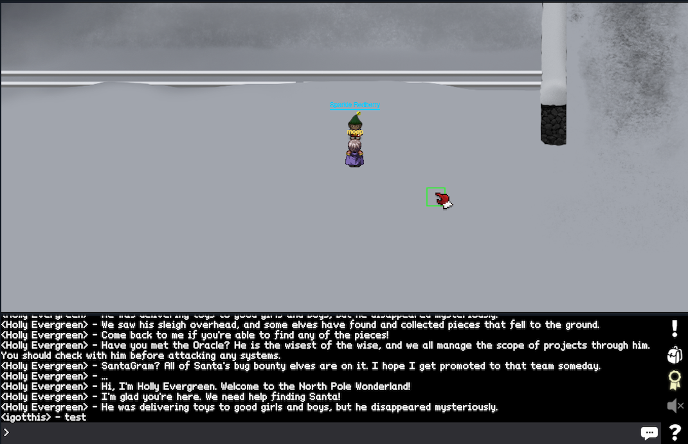

He tells you about the NetWars challenge coins. To gather all of them is a new
quest which you receive from him. Since they do not contribute to the answering
of the questions, we will omit these coins for the rest of the write-up.

If you cross the bridge to the north (and keep going north a bit), you will run
into Wunorse Openslae.


She mentions that Santa's sleigh is managed by a SCADA interface, for which you
need a Cranberry Pi with a Cranbian Linux. You get a link to a [SANS website](https://pen-testing.sans.org/blog/2016/12/07/mount-a-raspberry-pi-file-system-image)
which details how to mount a raspberry pi image. As of SantaGram, you get the intel
that it is popular, and a hashtag: `#elflife!`.

If you back off to the bridge again, and then go to the right, you will be able
to enter `Elf House #2`.

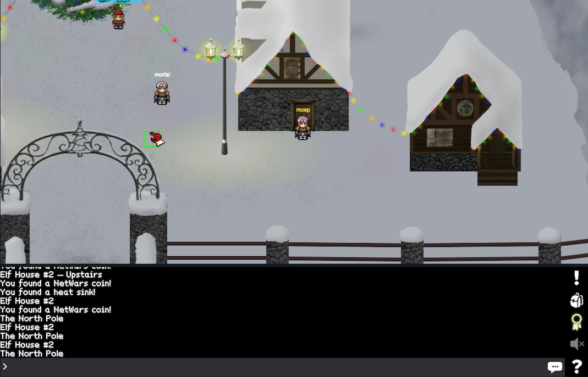

Enter it, go up the stairs and through the doorway, and you will find yourself
in this room.


On the left of the position of my avatar, there lies a heatsink. Go collect it.
We will need it later on to assemble our Cranberry Pi.

Next, head over all the way to the left until you reach this house.


Enter it. Then talk to Sugarplum Mary.


She is a PHP developer (and apparently loves it). You will get a link to another
[SANS website](https://pen-testing.sans.org/blog/2016/12/07/getting-moar-value-out-of-php-local-file-include-vulnerabilities)
which is about PHP local file inclusion vulnerabilities.

Besides PHP stuff, there is also a secret in this room. You can just walk through
the fireplace and enter a small chamber. There you will find the Cranberry PI board.


Heading back all the way to the right, you will find the big tree.

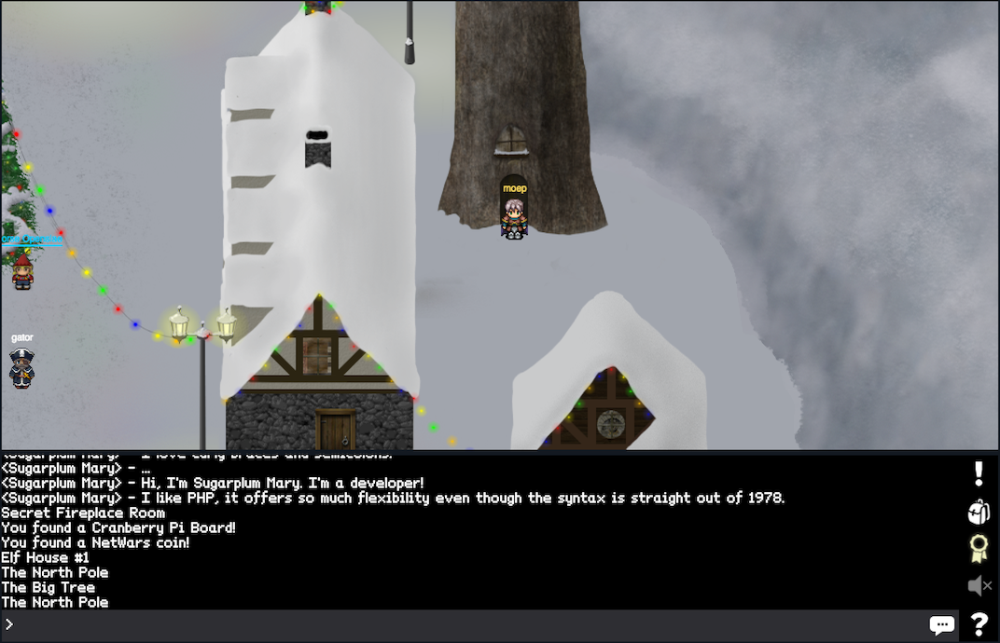

Inside, you will find Tom Hessman who apparently is an oracle.

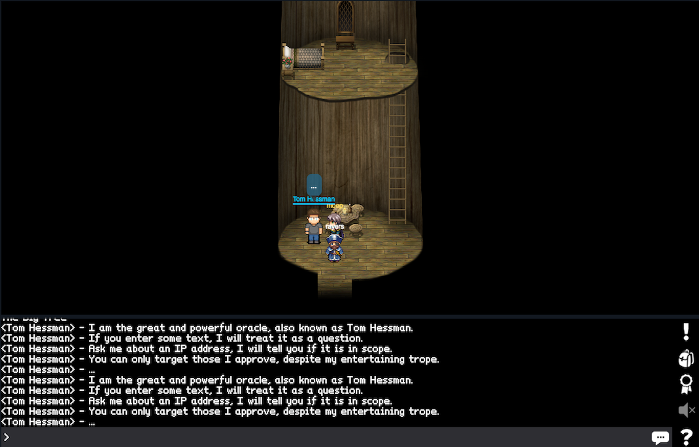

He offers you to tell you whether a certain IP address is in scope or not. I guess this is a safety net so that SANS cannot be blamed for people going crazy with offensive security while blaming the SANS holiday hack challenge :D

If we go further north, there is a snow man. He holds a power cord, which we can collect.


Up the three, you will enter the NetWars room.


You can leave it on the right side. Follow the path and enter the next house.


Minty Candycane is the NPC. She talks about tools such as NMAP, John the Ripper
and also provides a link to the [RockYou dictionary](https://wiki.skullsecurity.org/index.php?title=Passwords).

Exit the house again and continue to follow the path. You will go up all the way
to the top of a mountain.


Talk to Bushy Evergreen on the right. He will provide you with two links regarding Android hacking ([here](https://ibotpeaches.github.io/Apktool/) and [here](https://www.youtube.com/watch?v=mo2yZVRicW0)).

Head over to the left and collect the SD card.


Enter the house, go to the top left corner, and collect the HDMI cable.

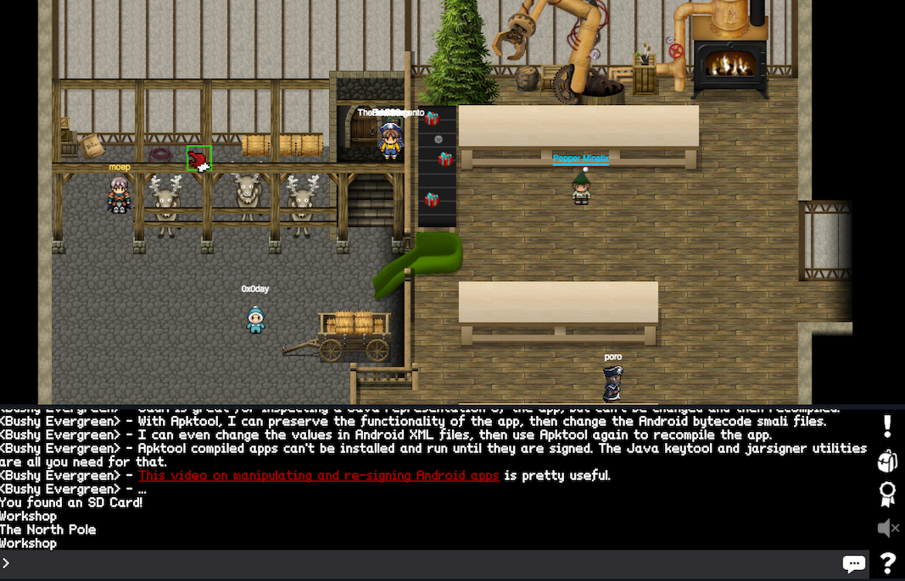

Go back to the center of the room and talk to Pepper Minstix.


He will provide with links to [Meteor](https://www.meteor.com/), [SANS training on hacking Meteor](https://pen-testing.sans.org/blog/2016/12/06/mining-meteor), [a tool called MetorMiner](https://github.com/nidem/MeteorMiner) and to [TamperMonkey](https://tampermonkey.net/).

Enter the room on the right.


You cannot interact with the train (as it requires a Cranberry Pi). Talking to Shinny Upatree in the room gives you a link to a [.pptx](http://www.willhackforsushi.com/presentations/gitd-hackfest.pptx) file.

At this point, we decided that we did enough reconnaissance (by actually walking around and talking to NPCs). Let's get back to the very first intel that we gathered. We checked the Twitter account, but we omitted the Instagram account. Let's to that now.


If you look closely on the left most image, you will get two important pieces of intel:
1. The name `www.northpolewonderland.com` which is printed on the sheet of paper that show the NMAP scan result.
2. The file name `SantaGram_v4.2.zip`

If you browse to http://www.northpolewonderland.com/, you will see Santa's business card again. If you browse to http://www.northpolewonderland.com/SantaGram_v4.2.zip, you can actually download a file.

We first check what type of file we got:

```
file SantaGram_v4.2.zip
SantaGram_v4.2.zip: Zip archive data, at least v2.0 to extract
```

So it seems to be a `ZIP` file indeed. However, it has a password on it.

```
unzip SantaGram_v4.2.zip
Archive:  SantaGram_v4.2.zip
[SantaGram_v4.2.zip] SantaGram_4.2.apk password:
```

Using the secret message from the tweets as password gives us the content. To be fair, at first I went down a completely different road. I tried to break the ZIP password with John the Ripper. We already got a hint to the [RockYou dictionary](https://wiki.skullsecurity.org/index.php?title=Passwords). In order to get a hash out of the ZIP file that we can crack, Google let us to http://www.cybercrimetech.com/2014/07/how-to-cracking-zip-and-rar-protected.html. Using `zip2john`, I got the following hash.

```
SantaGram_v4.2.zip:$pkzip2$1*2*3*0*1df34a*2271ee*ede16a54*0*4b*8*12*ede1*45ec*SantaGram_v4.2.zip*$/pkzip2$:::::SantaGram_v4.2.zip
```

Unfortunately, just throwing john and the rockyou wordlist on the hash did not yield any results. But just calling `john hashfile` did the trick. It took approximately 20minutes on my MacBook Pro to complete.

But be it as it may - directly using the password from the tweets was likely the intended way to do things :)

Digging further, we can now have a deeper look at the `apk` file. Earlier, Bushy Evergreen mentioned `apktool`. Let's give it a try.

```
apktool d SantaGram_4.2.apk
```

This gives us the extracted contents of the file in the folder `SantaGram_4.2`. The next two questions are about contents of the APK file (username/password and the name of the audible component). By browsing the directory structure, we soon found the file `res/raw/discombobulatedaudio1.mp3`. Which seems to be the answer to question 4.

Now for the username and password. We suspected them to be in the code (rather than hidden in some other resources). So we navigated to the folder that contains the `smali` files. We even further navigated to the folder that I guess represents the Java classes that are in the `com.northpolewonderland.santagram` Java package. After that, `grep` did the trick.

In `SantaGram_4.2/smali/com/northpolewonderland/santagram`:
```
grep -C3 -rin "password" .
./b.smali-414-
./b.smali-415-    invoke-virtual {v0, v1, v2}, Lorg/json/JSONObject;->put(Ljava/lang/String;Ljava/lang/Object;)Lorg/json/JSONObject;
./b.smali-416-
./b.smali:417:    const-string v1, "password"
./b.smali-418-
./b.smali-419-    const-string v2, "busyreindeer78"
./b.smali-420-
--
[...]
```

Inspecting the file, we get the next flag: `username=guest`, `password=busyreindeer78`.

Next, we can have a look at the Cranberry Pi. As it turns out, we do have collected all the necessary pieces. We can return the quest to Holly Evergreen (right in front of the first house).


We also get a download link to the [Cranbian image](https://www.northpolewonderland.com/cranbian.img.zip). Since the next question is about the username of what seems to be a local account on the Cranbian image, it is a good idea to mount it. Earlier in the game, we already got a link to a [howto](https://pen-testing.sans.org/blog/2016/12/07/mount-a-raspberry-pi-file-system-image) for that.

Unfortunately, the `fdisk` utility on OS X does not work the way that is mentioned in the howto. So I had to switch to a Kali VM for the first time during this holiday hack.

```
fdisk -l cranbian-jessie.img
Disk cranbian-jessie.img: 1.3 GiB, 1389363200 bytes, 2713600 sectors
Units: sectors of 1 * 512 = 512 bytes
Sector size (logical/physical): 512 bytes / 512 bytes
I/O size (minimum/optimal): 512 bytes / 512 bytes
Disklabel type: dos
Disk identifier: 0x5a7089a1

Device               Boot  Start     End Sectors  Size Id Type
cranbian-jessie.img1        8192  137215  129024   63M  c W95 FAT32 (LBA)
cranbian-jessie.img2      137216 2713599 2576384  1.2G 83 Linux
```

In order to mount the Linux image, we have to calculate the offset in bytes.

```
echo $((512*137216))
70254592
```

And then mount the image.

```
mount -v -o offset=70254592 cranbian-jessie.img mnt/
mount: /dev/loop0 mounted on ... ./mnt
```

Now, a `cat` on the `mnt/etc/shadow` file reveals the password hash for the cranpi user.

```
cranpi:$6$2AXLbEoG$zZlWSwrUSD02cm8ncL6pmaYY/39DUai3OGfnBbDNjtx2G99qKbhnidxinanEhahBINm/2YyjFihxg7tgc343b0:17140:0:99999:7:::
```

This is a pretty strong hash, as `hashid` confirms:

```
hashid cranpi.hash
--File 'cranpi.hash'--
Analyzing '$6$2AXLbEoG$zZlWSwrUSD02cm8ncL6pmaYY/39DUai3OGfnBbDNjtx2G99qKbhnidxinanEhahBINm/2YyjFihxg7tgc343b0'
[+] SHA-512 Crypt
--End of file 'cranpi.hash'
```

Nevertheless, I gave it a try with John the Ripper and with hashcat. The cracking speed was - well - a desaster: `Speed/sec.: 441 plains, 441 words` for hashcat. John had a similar speed. All this on an early 2015 MacBook Pro with a 2,7 GHz Intel Core i5. The John the Ripper speed declined however during the course of the cracking. So I stopped the process. It took hashcat 66 minutes to crack the hash, giving us the answer to question 5: `yummycookies`.

```
$6$2AXLbEoG$zZlWSwrUSD02cm8ncL6pmaYY/39DUai3OGfnBbDNjtx2G99qKbhnidxinanEhahBINm/2YyjFihxg7tgc343b0:yummycookies

All hashes have been recovered

Input.Mode: Dict (02_rockyou.txt)
Index.....: 1/5 (segment), 3627172 (words), 33550343 (bytes)
Recovered.: 1/1 hashes, 1/1 salts
Speed/sec.: - plains, 452 words
Progress..: 1814156/3627172 (50.02%)
Running...: 00:01:06:46
Estimated.: 00:01:06:51
```

In order to proceed, you need to tell the password to Holly Evergreen.

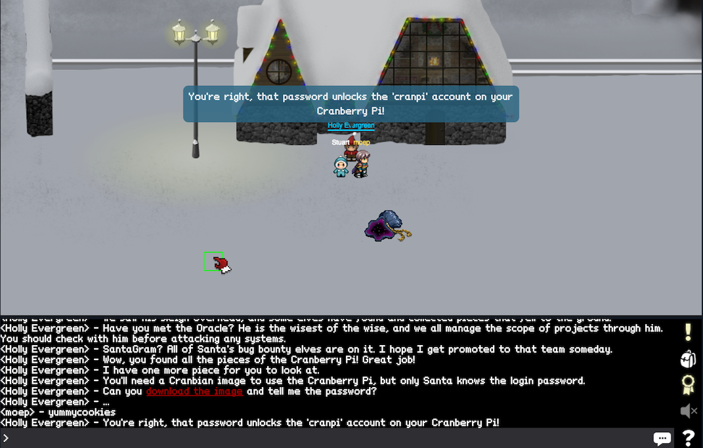

With that out of the way, we can use the Cranberry Pi to interact with the terminals. We start at the elf house number 2.


We find ourselves at a terminal, which seems to be a freshly spawned Docker container. The task is to find two parts of a passphrase inside the `/out.pcap` file.

```
scratchy@2a1a07f0bfaa:/$ ls -al out.pcap
-r-------- 1 itchy itchy 1087929 Dec  2 15:05 out.pcap
scratchy@2a1a07f0bfaa:/$ id
uid=1001(scratchy) gid=1001(scratchy) groups=1001(scratchy)
scratchy@2a1a07f0bfaa:/$
```

The first obstacle are the file permissions. We are the user `scratchy`, but the file can only be read by the user `itchy`. In such cases, it is a good idea to check `sudo` as well as to look for binaries with the `s-bit` set. `sudo -l` gives us some pretty useful information.

```
scratchy@2a1a07f0bfaa:/$ sudo -l
sudo: unable to resolve host 2a1a07f0bfaa
Matching Defaults entries for scratchy on 2a1a07f0bfaa:
    env_reset, mail_badpass,
    secure_path=/usr/local/sbin\:/usr/local/bin\:/usr/sbin\:/usr/bin\:/sbin\:/bin
User scratchy may run the following commands on 2a1a07f0bfaa:
    (itchy) NOPASSWD: /usr/sbin/tcpdump
    (itchy) NOPASSWD: /usr/bin/strings
scratchy@2a1a07f0bfaa:/$
```

As user `scratchy`, we are allowed to run the commands `tcpdump` and `strings` as the user `itchy`, without having to authenticate via a password. Perfect. Let's start with `strings`. Since we are operating in a somewhat limited environment (for example there is no `less`), we will print the output to a file and use `vim` to have a look at it.

```
scratchy@2a1a07f0bfaa:/$ sudo -u itchy strings out.pcap >/tmp/out.pcap.strings
sudo: unable to resolve host 2a1a07f0bfaa
scratchy@2a1a07f0bfaa:/$
```

We see some HTTP traffic. And already in line 32, we get the first half of the passphrase: `santasli`. From there on, you could almost guess the full passphrase. But we will do it the hard way and actually look for the second half. Things start to get trickier here, because the second half seems to be hidden in a binary file.

```
DGET /secondhalf.bin HTTP/1.1
User-Agent: Wget/1.17.1 (darwin15.2.0)
Accept: */*
Accept-Encoding: identity
Host: 192.168.188.130
Connection: Keep-Alive
ZAX
THTTP/1.0 200 OK
TServer: SimpleHTTP/0.6 Python/2.7.12+
ZAX"
,#"=X
TDate: Fri, 02 Dec 2016 11:28:00 GMT
Content-type: application/octet-stream
ZAXr
,#o=X
UContent-Length: 1048097
Last-Modified: Fri, 02 Dec 2016 11:26:12 GMT
```

It took me almost 3 hours to get behind that. I struggled with `tcpdump` for a long time. Trying to extract the binary file for further processing. After I did not make any reasonable progress, I noticed in the chat that another player was having issues with this particular challenge, too. The answer he got was basically: 'Do not overthink it. Read the manpages of your tools. Try harder.' Well - I did :).

I had a look at the `tcpdump` again an noticed that the `User-Agent` suggest the binary was downloaded to an OS X El Capitan system. So maybe the binary file was also compiled for that specific architecture, or maybe another one? Be it as it may, this lead me to look at the manpage for `strings` again, where I noticed that you can specify the encoding with the `-e` option. Since Intel x86 processors use little endian, I started with the respective options. And I got a hit.

```
scratchy@681628e3e251:/$ sudo -u itchy strings -e l out.pcap
sudo: unable to resolve host 681628e3e251
part2:ttlehelper
```

So the password for the door in the same room is `santaslittlehelper`. Behind the door, you meet Alabaster Snowball.

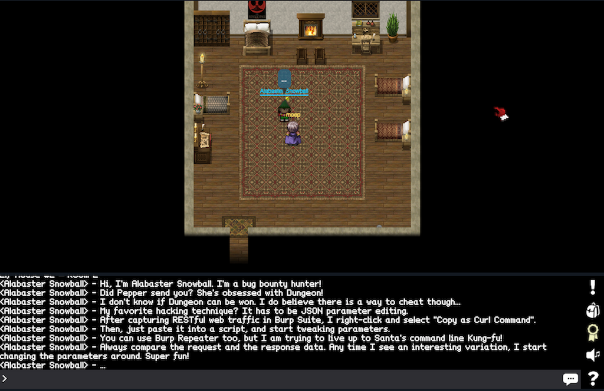

He tells you something about JSON, Burp and how to export request from Burp so that you can directly use them as a `cURL` command on the shell. Also, he mentions a dungeon (which I apparently have not found yet).

On to the next terminal. This time, the task is _'To open the door, find the passphrase file deep in the directories.'_ It is located in the building on the top of the mountain. This was easier than expected. A simple `find` lists all the directories.

```
*******************************************************************************
*                                                                             *
* To open the door, find the passphrase file deep in the directories.         *
*                                                                             *
*******************************************************************************
elf@5f09ad2e85a2:~$ find
.
./.bashrc
./.doormat
./.doormat/.
./.doormat/. /
./.doormat/. / /\
./.doormat/. / /\/\\
./.doormat/. / /\/\\/Don't Look Here!
./.doormat/. / /\/\\/Don't Look Here!/You are persistent, aren't you?
./.doormat/. / /\/\\/Don't Look Here!/You are persistent, aren't you?/'
./.doormat/. / /\/\\/Don't Look Here!/You are persistent, aren't you?/'/key_for_the_door
.txt
./.doormat/. / /\/\\/Don't Look Here!/You are persistent, aren't you?/cookbook
./.doormat/. / /\/\\/Don't Look Here!/You are persistent, aren't you?/temp
./.doormat/. / /\/\\/Don't Look Here!/secret
./.doormat/. / /\/\\/Don't Look Here!/files
./.doormat/. / /\/\\/holiday
./.doormat/. / /\/\\/temp
./.doormat/. / /\/santa
./.doormat/. / /\/ls
./.doormat/. / /opt
./.doormat/. / /var
./.doormat/. /bin
./.doormat/. /not_here
./.doormat/share
./.doormat/temp
./var
./temp
./.profile
./.bash_logout
elf@5f09ad2e85a2:~$
```

In order to access the file with the password, I choose to use the `print0` option of `find`, so that a binary 0 is used as delimiter (instead of space).

```
elf@5f09ad2e85a2:~$ find . -iname '*for_*' -print0 | xargs -0 cat
key: open_sesame
```

So the password is `open_sesame`. The reward is access to Santa's office.

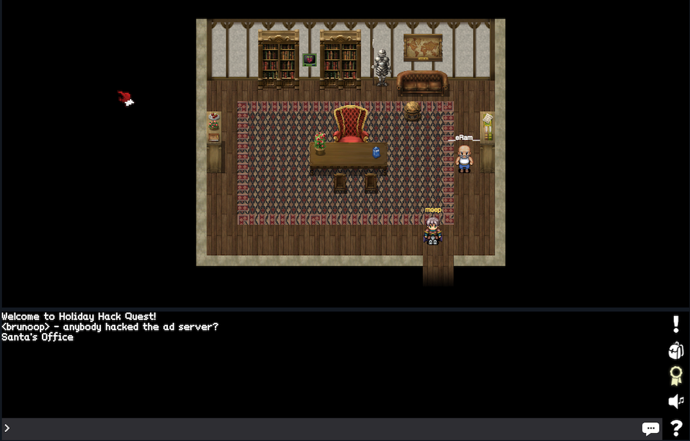

In it, there is another terminal. When you interact with it, you can actually replay a part of the movie Wargames. The challenge here is simply to look up a good [transcript](https://github.com/theunamedguy/wargames/blob/master/TRANSCRIPT) of the movie or to watch the respective [YouTube clips](https://www.youtube.com/watch?v=LwDbgE54QYE&list=PLZbXA4lyCtqpGOS2KC1mAAKaGwbup-DQt&index=1).


The flag you get is: `LOOK AT THE PRETTY LIGHTS`.

Back in the workshop, I noticed that there is a second terminal.

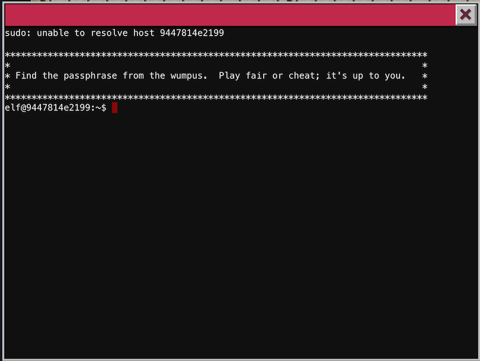

Start the game `wumpus`. I just played it, until I finally got the Wumpus. The passphrase is `WUMPUS IS MISUNDERSTOOD`.

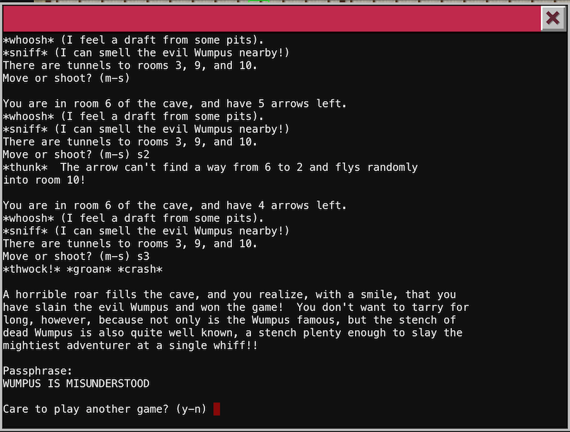

With the passphrase, we can pass the door next to the terminal.


Right now, I could not find anything of interest in it. Next, we will check out the terminal at the train.


If we set the brakes to off, and then try to start the train, we are asked for a password which we do not know. The hint to make progress is buried in the `HELP` message.

> **HELP** brings you to this file.  If it's not here, this console cannot do it, unLESS you know something I don't.

So it seems that the `less` command is executed to display the message. Which is neat, cause we can do SHELL commands this way by leveraging the `! <command>` feature of `less` [as described in the mangpage](https://linux.die.net/man/1/less). An `ls -al` gives the following.

```
menu:main> HELP
total 40
drwxr-xr-x 2 conductor conductor  4096 Dec 10 19:39 .
drwxr-xr-x 6 root      root       4096 Dec 10 19:39 ..
-rw-r--r-- 1 conductor conductor   220 Nov 12  2014 .bash_logout
-rw-r--r-- 1 conductor conductor  3515 Nov 12  2014 .bashrc
-rw-r--r-- 1 conductor conductor   675 Nov 12  2014 .profile
-rwxr-xr-x 1 root      root      10528 Dec 10 19:36 ActivateTrain
-rw-r--r-- 1 root      root       1506 Dec 10 19:36 TrainHelper.txt
-rwxr-xr-x 1 root      root       1588 Dec 10 19:36 Train_Console
!done  (press RETURN)
```

We get the password by doing a `grep -in pass Train_Console`.

```
menu:main> HELP
7:PASS="24fb3e89ce2aa0ea422c3d511d40dd84"
72:                             read -s -p "Enter Password: " password
73:                             [ "$password" == "$PASS" ] && QUEST_UID=$QUEST_UID ./Act
ivateTrain || echo "Access denied"
!done  (press RETURN)
```

And off we go, back in time to 1978.

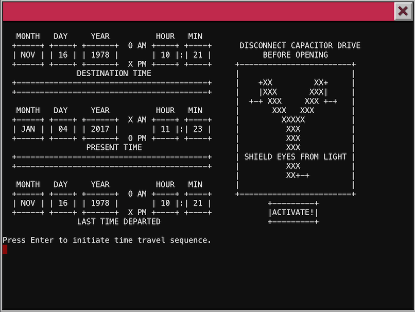


> &token=335BC464-BB2C-11E6-A4A6-CEC0C932CE01
> 10.240.0.19

While searching the place, you will finally find Santa in the back room of the train station.


Plus - see some credits.


Unfortunately, he does not remember who kidnapped him. In order to tackle questions 7 and 8, we have to have a look at the SantaGram app again (as clearly point out in the story text on the website). Going through the decompiled app, searching for URLs lead me to the file `./res/values/strings.xml`.

```xml
<string name="analytics_launch_url">https://analytics.northpolewonderland.com/report.php?type=launch</string>
<string name="analytics_usage_url">https://analytics.northpolewonderland.com/report.php?type=usage</string>
<string name="appVersion">4.2</string>
<string name="app_name">SantaGram</string>
<string name="appbar_scrolling_view_behavior">android.support.design.widget.AppBarLayout$ScrollingViewBehavior</string>
<string name="banner_ad_url">http://ads.northpolewonderland.com/affiliate/C9E380C8-2244-41E3-93A3-D6C6700156A5</string>
<string name="bottom_sheet_behavior">android.support.design.widget.BottomSheetBehavior</string>
<string name="character_counter_pattern">%1$d / %2$d</string>
<string name="debug_data_collection_url">http://dev.northpolewonderland.com/index.php</string>
<string name="debug_data_enabled">false</string>
<string name="dungeon_url">http://dungeon.northpolewonderland.com/</string>
<string name="exhandler_url">http://ex.northpolewonderland.com/exception.php</string>
<string name="title_activity_comments">Comments</string>
```

Which gave us some new targets to attack.

```
➜  SantaGram_4.2 git:(master) ✗ dig +short analytics.northpolewonderland.com
104.198.252.157
➜  SantaGram_4.2 git:(master) ✗ dig +short ads.northpolewonderland.com
104.198.221.240
➜  SantaGram_4.2 git:(master) ✗ dig +short dev.northpolewonderland.com
35.184.63.245
➜  SantaGram_4.2 git:(master) ✗ dig +short dungeon.northpolewonderland.com
35.184.47.139
➜  SantaGram_4.2 git:(master) ✗ dig +short ex.northpolewonderland.com
104.154.196.33
```

After checking each of the IP address with the oracle (Tom Hessman), we had the permission to test.

## analytics.northpolewonderland.com 104.198.252.157

```
nmap 104.198.252.157 --script=default


Starting Nmap 7.31 ( https://nmap.org ) at 2017-01-04 13:55 CET
Nmap scan report for 157.252.198.104.bc.googleusercontent.com (104.198.252.157)
Host is up (0.13s latency).
Not shown: 998 filtered ports
PORT    STATE SERVICE
22/tcp  open  ssh
| ssh-hostkey:
|   1024 5d:5c:37:9c:67:c2:40:94:b0:0c:80:63:d4:ea:80:ae (DSA)
|   2048 f2:25:e1:9f:ff:fd:e3:6e:94:c6:76:fb:71:01:e3:eb (RSA)
|_  256 4c:04:e4:25:7f:a1:0b:8c:12:3c:58:32:0f:dc:51:bd (ECDSA)
443/tcp open  https
| http-git:
|   104.198.252.157:443/.git/
|     Git repository found!
|     Repository description: Unnamed repository; edit this file 'description' to name the...
|_    Last commit message: Finishing touches (style, css, etc)
| http-title: Sprusage Usage Reporter!
|_Requested resource was login.php
| ssl-cert: Subject: commonName=analytics.northpolewonderland.com
| Subject Alternative Name: DNS:analytics.northpolewonderland.com
| Not valid before: 2016-12-07T17:35:00
|_Not valid after:  2017-03-07T17:35:00
|_ssl-date: TLS randomness does not represent time
| tls-nextprotoneg:
|_  http/1.1

Nmap done: 1 IP address (1 host up) scanned in 15.29 seconds
```

### login page

Recall the username/password from question 2, which is actually used to authenticate against the analytics service. Login, then simply use the download link `MP3` to get the file `discombobulatedaudio2.mp3`.


### git repo

Somebody left a git repo on the web server. You cannot directly clone it, but you can get it as follows:
```
wget -r --no-parent https://analytics.northpolewonderland.com/.git/
cd analytics.northpolewonderland.com
git checkout .
```

Since I already got the audio file, I stopped further digging into it.

> ads.northpolewonderland.com 104.198.221.240

```
nmap --script=default 104.198.221.240


Starting Nmap 7.31 ( https://nmap.org ) at 2017-01-05 18:00 CET
Nmap scan report for 240.221.198.104.bc.googleusercontent.com (104.198.221.240)
Host is up (0.13s latency).
Not shown: 998 filtered ports
PORT   STATE SERVICE
22/tcp open  ssh
| ssh-hostkey:
|   1024 cf:4c:e0:20:6d:e7:c6:b1:6b:9f:ac:75:45:16:b1:93 (DSA)
|   2048 b9:a4:df:1e:34:0f:58:3e:2c:b7:e6:c6:77:0f:f5:3b (RSA)
|_  256 02:ec:fc:80:c0:fc:76:b3:cd:d2:64:39:af:3c:13:b3 (ECDSA)
80/tcp open  http
|_http-title: Ad Nauseam - Stupid Ads for Stupid People

Nmap done: 1 IP address (1 host up) scanned in 13.81 seconds
```

> dev.northpolewonderland.com 35.184.63.245

```
nmap --script=default 35.184.63.245


Starting Nmap 7.31 ( https://nmap.org ) at 2017-01-05 18:01 CET
Nmap scan report for 245.63.184.35.bc.googleusercontent.com (35.184.63.245)
Host is up (0.13s latency).
Not shown: 998 filtered ports
PORT   STATE SERVICE
22/tcp open  ssh
| ssh-hostkey:
|   1024 79:a9:ac:53:73:c7:87:69:61:c8:6f:7c:cd:e4:5d:f2 (DSA)
|   2048 f2:fb:1c:aa:92:78:ae:04:7d:19:f9:74:e8:91:00:b6 (RSA)
|_  256 5e:05:a6:1b:76:72:74:2b:9f:a5:e5:06:f8:fa:4f:39 (ECDSA)
80/tcp open  http
|_http-title: Site doesn't have a title (application/json).

Nmap done: 1 IP address (1 host up) scanned in 13.95 seconds
```

> dungeon.northpolewonderland.com 35.184.47.139

```
nmap --script=default 35.184.47.139


Starting Nmap 7.31 ( https://nmap.org ) at 2017-01-05 18:01 CET
Nmap scan report for 139.47.184.35.bc.googleusercontent.com (35.184.47.139)
Host is up (0.13s latency).
Not shown: 994 closed ports
PORT      STATE    SERVICE
22/tcp    open     ssh
| ssh-hostkey:
|   1024 c0:5a:84:94:cf:6f:b9:23:c8:23:32:66:2d:e2:e7:6e (DSA)
|   2048 c4:cf:f2:c3:c5:63:26:bb:34:ab:b6:fe:a0:73:91:49 (RSA)
|_  256 78:4a:3e:2f:24:d1:14:eb:6e:53:7d:5a:6c:0a:42:af (ECDSA)
80/tcp    open     http
|_http-title: About Dungeon
135/tcp   filtered msrpc
139/tcp   filtered netbios-ssn
179/tcp   filtered bgp
11111/tcp open     vce

Nmap done: 1 IP address (1 host up) scanned in 14.43 seconds
```

> ex.northpolewonderland.com 104.154.196.33

```
nmap --script=default 104.154.196.33


Starting Nmap 7.31 ( https://nmap.org ) at 2017-01-05 18:02 CET
Nmap scan report for 33.196.154.104.bc.googleusercontent.com (104.154.196.33)
Host is up (0.13s latency).
Not shown: 998 filtered ports
PORT   STATE SERVICE
22/tcp open  ssh
| ssh-hostkey:
|   1024 46:40:e3:46:26:8a:af:ee:11:d6:40:91:5a:b7:81:78 (DSA)
|   2048 8f:24:b7:32:1d:b8:7e:80:02:b5:d5:ae:3a:ee:f5:dc (RSA)
|_  256 f2:ca:f2:ae:a9:08:2f:4d:47:e2:b0:06:b2:24:2d:b9 (ECDSA)
80/tcp open  http
|_http-title: 403 Forbidden

Nmap done: 1 IP address (1 host up) scanned in 14.09 seconds
```

## Part 1: A Most Curious Business Card

### 1) What is the secret message in Santa's tweets?

BUGBOUNTY

### 2) What is inside the ZIP file distributed by Santa's team?

A file named `SantaGram_4.2.apk`.

## Part 2: Awesome Package Konveyance

### 3) What username and password are embedded in the APK file?

```
username=guest
password=busyreindeer78
```

### 4) What is the name of the audible component (audio file) in the SantaGram APK file?

`discombobulatedaudio1.mp3`

## Part 3: A Fresh-Baked Holiday Pi

### 5) What is the password for the "cranpi" account on the Cranberry Pi system?

`yummycookies`

### 6) How did you open each terminal door and where had the villain imprisoned Santa?

* Terminal in Elf House 2
 * Realize via `sudo -l` that you can do `tcpdump` and `strings` as user `itchy`
 * A simple `strings` call gives you part 1: `santasli`
 * A `strings` call with `-e l` (for 16bit little endian) gives you part 2: `ttlehelper`
 * `tcpdump` helps to understand what traffic was captured and gives you a hint to the endianess thing

* Terminal 1 in the Workshop
 * Do a `find` to learn the directory structure
 * Do `find . -iname '*for_*' -print0 | xargs -0 cat` to access the password

* Terminal 2 in the Workshop
 * I literally just played the Wumpus game.

* Terminal Santa's Office
 * Use a transcript of Wargames / YoutTube to give the correct answers

## Part 4: My Gosh... It's Full of Holes

### 7) ONCE YOU GET APPROVAL ...

### 8) What are the names of the audio files you discovered from each system above?
